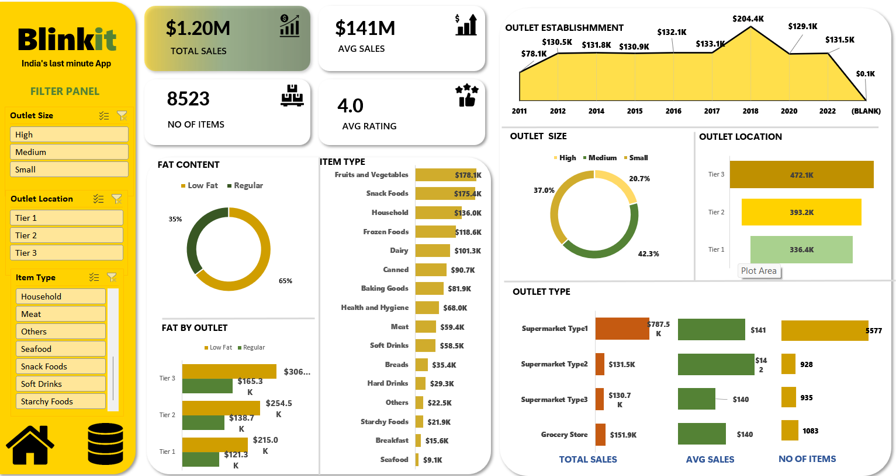

# 🛒 Blinkit Sales Dashboard | Microsoft Excel

> **Transforming raw sales data into actionable business insights using Microsoft Excel.**


## 📌 Project Overview

The **Blinkit Sales Dashboard** is an interactive business intelligence solution developed in **Microsoft Excel** to analyze grocery sales performance, customer purchasing behavior, and outlet efficiency.

This dashboard enables users to monitor key performance indicators (KPIs), identify sales trends, compare outlet performance, and make data-driven decisions through dynamic visualizations and interactive filters.

---

## 🎯 Business Objectives

✔ Analyze overall sales performance

✔ Compare outlet performance by size and location

✔ Identify top-selling product categories

✔ Evaluate customer ratings and purchasing patterns

✔ Support business decision-making through interactive dashboards

---

## 🛠️ Tools & Skills

| Tool | Purpose |
|------|---------|
| Microsoft Excel | Dashboard Development |
| Pivot Tables | Data Analysis |
| Pivot Charts | Visualization |
| Slicers | Interactive Filtering |
| Excel Functions | Data Cleaning |
| Conditional Formatting | KPI Highlighting |

---

## 📊 Key Performance Indicators

| KPI | Description |
|-----|-------------|
| 💰 Total Sales | Overall Revenue |
| 📦 Number of Items | Products Sold |
| ⭐ Average Rating | Customer Satisfaction |
| 💵 Average Sales | Sales per Transaction |

---

## 📈 Dashboard Analysis

- 📊 Sales by Item Type
- 🥛 Fat Content Analysis
- 🏪 Outlet Size Analysis
- 🌍 Outlet Location Analysis
- 📅 Outlet Establishment Trend
- 🏬 Outlet Type Performance
- 🎛 Interactive Slicers

---

## 💡 Key Insights

- Identified the highest revenue-generating product categories.
- Compared sales performance across different outlet sizes.
- Evaluated customer preferences based on ratings and fat content.
- Analyzed outlet establishment trends to understand business growth.
- Built an interactive dashboard for faster and better decision-making.

---

## 🚀 Business Impact

✅ Improved reporting efficiency

✅ Enabled data-driven decision making

✅ Simplified sales performance monitoring

✅ Identified customer buying trends

---

## 📷 Dashboard Preview

> Click the image to view in full size.

Interactive Excel Dashboard built using Pivot Tables, Pivot Charts, KPI Cards, and Slicers.



---

## 📂 Project Structure

```text
📁 Excel-Blinkit-Sales-Dashboard
│── 📄 README.md
│── 📊 Blinkit Sales Dashboard.xlsx
│── 📁 Dataset
│── 📁 images
│     └── Blinkit_Dashboard.png
```

---

## ⭐ Skills Demonstrated

- Data Cleaning
- Data Analysis
- Dashboard Design
- KPI Reporting
- Business Intelligence
- Microsoft Excel
- Pivot Tables
- Pivot Charts
- Slicers
- Data Visualization

---

## 👨‍💻 Author

**Vinay Siddharudh Thisake**

📊 Data Analyst | Power BI | SQL | Python | Excel | Salesforce

⭐ If you found this project useful, don't forget to **Star** this repository!
